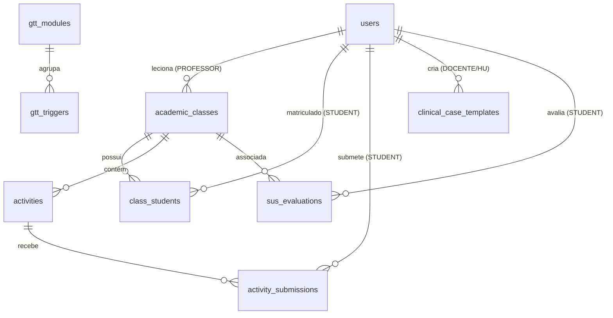

# SIGEA — Arquitetura Sistêmica e Design Clínico

**Instituição**: Universidade Federal de Sergipe (UFS) — DCOMP / Departamento de Enfermagem  
**Autor Líder**: Matheus Araujo Pereira  
**Orientadores**: Profª. Drª. Ana Waleska de Menezes Seixas Souza, Prof. Dr. Gilton José Ferreira da Silva  
**Aprovação Ética**: Comitê de Ética em Pesquisa (CEP/UFS) — Parecer CAAE nº 91836925.8.0000.5546  
**SGBD Homologado**: PostgreSQL 16 LTS | **Linguagens**: Java 21 LTS & TypeScript  

---

## 1. Visão Geral e Propósito do Sistema

O **SIGEA** (*Sistema Inteligente de Gestão de Eventos Adversos*) é uma plataforma hospitalar e educacional projetada para informatizar e operacionalizar a metodologia **Global Trigger Tool (GTT)** do *Institute for Healthcare Improvement (IHI)*. O sistema possibilita:

1. **Detecção Ativa de Gatilhos Clínicos**: Varredura estruturada de prontuários em busca dos 53 gatilhos padronizados do IHI.
2. **Auditoria Clínica em Duas Etapas**: Revisão primária individual (estudantes/enfermeiros auditores) seguida de revisão de consenso (docente/médico sênior).
3. **Mensuração Epidemiológica de Danos**: Cálculo automático de taxas de eventos adversos (EAs por 1.000 pacientes-dia, EAs por 100 admissões e percentual de pacientes com dano).
4. **Análise Causal com Ferramentas da Qualidade**: Aplicação integrada de Diagrama de Ishikawa (6M), 5W2H, Matriz GUT e Ciclo PDCA.
5. **Avaliação Psicométrica de Usabilidade**: Coleta da Escala de Usabilidade do Sistema (SUS - Brooke, 1996).

---

## 2. Topologia Monorepo e Stack Tecnológica

O ecossistema está organizado em um monorepo modular e desacoplado:

```
SIGEA/
├── backend/               # API RESTful Spring Boot 3.3.x (Java 21 LTS)
├── frontend/              # SPA Angular 18+ (Signals, Standalone Components, TailwindCSS)
├── database/              # DDL e DML unificados para PostgreSQL 16 LTS
├── docs/                  # Guias de desenvolvimento, homologação e referências oficiais
├── config/                # Docker Compose local e IaC (Render / Vercel)
└── projeto_departamental/ # Monografia e relatórios técnicos em LaTeX (abnTeX2 DCOMP/UFS)
```

### 2.1 Backend (API RESTful)
- **Runtime**: Java 21 LTS.
- **Framework**: Spring Boot 3.3.x.
- **Segurança**: Spring Security 6 com autenticação JWT stateless, filtro de expiração e criptografia BCrypt (custo 12).
- **Persistência**: Spring Data JPA e Hibernate 6 sobre PostgreSQL 16 LTS.
- **Migração e Versionamento**: Flyway Community Edition (`backend/src/main/resources/db/migration/`).
- **Validação de Entrada**: Bean Validation (`jakarta.validation.*`) com tratamento RFC 7807 (`ProblemDetail`).
- **Documentação da API**: SpringDoc OpenAPI 3 / Swagger UI (`/swagger-ui.html`).
- **Testes e Qualidade**: JUnit 5, Mockito, MockMvc e cobertura de 100% de linhas e branches via JaCoCo (`mvn clean verify`).

### 2.2 Frontend (Single-Page Application)
- **Framework**: Angular 18+.
- **Arquitetura Reativa**: Standalone Components, novos blocos de controle de fluxo (`@if`, `@for`, `@switch`) e Signals reativos.
- **Estilização e Design System**: TailwindCSS configurado para paleta clínica hospitalar e Angular Material para primitivas de acessibilidade.
- **Gerenciamento de Estado**: Signals locais e Services com comportamento reativo puro (sem dependência de RxJS boilerplate desnecessário).
- **Testes Unitários**: Jest com 100% de cobertura de branches, funções e linhas (`npm test`).

### 2.3 Banco de Dados Relacional
- **SGBD**: PostgreSQL 16 LTS.
- **Extensões**: `uuid-ossp` para geração de identificadores universais únicos (UUID v4).
- **Esquema Canônico**: 10 tabelas relacionais organizadas em [database/01_schema.sql](../database/01_schema.sql) e seeds padronizados em [database/02_seeds.sql](../database/02_seeds.sql).

---

## 3. Modelo de Domínio e Tabelas Canônicas



1. **`users`**: Controle de identidade, perfil de acesso (RBAC), e-mail institucional `@academico.ufs.br`, matrícula (discente) e flag de primeiro acesso obrigatório.
2. **`gtt_modules`**: Os 6 módulos de especialidade do IHI (Cuidados, Medicação, Cirúrgico, UTI, Perinatal, Urgência).
3. **`gtt_triggers`**: Os 53 gatilhos clínicos padronizados com códigos oficiais C1–C15, M1–M13, S1–S11, I1–I4, P1–P8 e E1–E2.
4. **`harm_severities`**: As 9 categorias de gravidade de dano do NCC MERP (A a I, sendo E a I consideradas dano real).
5. **`academic_classes`**: Turmas acadêmicas seguindo o padrão institucional (*Disciplina - Código - Período*).
6. **`class_students`**: Tabela associativa de alunos matriculados em turmas.
7. **`activities`**: Atividades avaliativas contendo prontuários simulados completos em `JSONB`.
8. **`activity_submissions`**: Submissões de auditoria dos alunos com gatilhos detectados, categoria de dano, ferramentas da qualidade preenchidas, nota (0 a 10) e feedback do professor.
9. **`clinical_case_templates`**: Catálogo de prontuários simulados curados pela equipe docente e do Hospital Universitário (HU/UFS).
10. **`sus_evaluations`**: Registros do questionário padronizado SUS (10 itens tipo Likert de 1 a 5, pontuação calculada de 0 a 100).

---

## 4. Segurança e Regras Institucionais Inegociáveis

1. **Restrição Estrita de Domínio de E-mail**:
   - Apenas o domínio `@academico.ufs.br` é aceito em cadastros e autenticações. Validação no frontend (Regex / formulários reativos) e backend (`@Pattern` / `UfsEmailValidator`).
2. **Perfis de Acesso (RBAC)**:
   - `ADMIN`: Gestão de usuários, módulos GTT, gatilhos, gravidades e turmas.
   - `PROFESSOR`: Criação de atividades, formulação de casos clínicos, correção com feedback e acompanhamento de dashboards.
   - `STUDENT`: Visualização de atividades, análise de prontuários simulados, preenchimento de ferramentas de qualidade e avaliação SUS.
3. **Campo Matrícula Discente**:
   - Visível e obrigatório **apenas** quando o perfil for `STUDENT`. Para `ADMIN` e `PROFESSOR`, o campo é oculto no formulário e persistido como `null` no banco.
4. **Ciclo de Primeiro Login**:
   - Todo usuário novo é cadastrado com senha provisória e `must_change_password = true`.
   - Ao autenticar, o sistema intercepta e bloqueia rotas, direcionando para `/first-login`. Após a definição de senha pessoal, `must_change_password` torna-se `false`.
5. **Bioética e Simulação**:
   - Dados clínicos são **100% simulados e fictícios** (Parecer CEP/UFS CAAE nº 91836925.8.0000.5546). É estritamente vedado o uso de dados de pacientes reais.

---

## 5. Ergonomia Visual Hospitalar (Desktop Only)

O SIGEA foi concebido exclusivamente para **estações de trabalho clínicas, laboratórios de informática e desktops hospitalares**, maximizando a densidade de informação:

1. **Resoluções de Referência**:
   - **WUXGA (1920 × 1200)**: Padrão principal de projeto.
   - **HD+ (1600 × 900)** e **HD (1280 × 720)**: Resolução mínima homologada.
   - **Ultrawide (2560 × 1080 e 3440 × 1440)**: Suporte a 21:9 com layout em painéis clínicos lado a lado.
   - **Proibição de Mobile**: Não há menus hambúrguer ou layouts estreitos de celular.
2. **Semiótica Cromática Hospitalar**:
   - **Azul Clínico Profundo** (`#1E3A8A`, `#2563EB`): Identidade institucional, navegação e comandos primários.
   - **Verde Esmeralda Cirúrgico** (`#059669`, `#10B981`): Sucesso, auditoria concluída, ausência de dano (Categorias A a D).
   - **Cinzas Neutros Hospitalares** (`#F8FAFC`, `#F1F5F9`, `#E2E8F0`, `#0F172A`): Superfícies de baixo cansaço visual e alto contraste WCAG AAA.
   - **Âmbar de Alerta Clínico** (`#D97706`, `#F59E0B`): Gatilhos positivos sob investigação, divergências de consenso.
   - **Carmim de Alto Risco** (`#DC2626`, `#EF4444`): Eventos adversos com dano grave ou óbito (Categorias E a I).
3. **Padrões de Interface**:
   - Tabelas de dados estritamente com **10 itens por página**, paginação explícita e debounce de busca de 300ms.
   - Modais de confirmação obrigatórios para qualquer ação destrutiva ou conclusão irreversível de auditoria.
   - Notificações não intrusivas via Toast Notification e indicador global de carregamento sobreposto.
